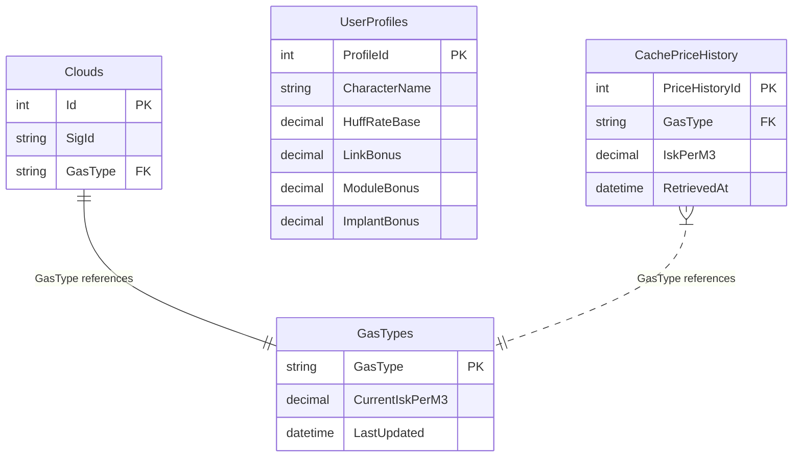

0. **Executive Summary**

   - A web tool for Eve Online players to parse and optimize gas-huffing operations.
   - Delivers faster decision-making, precise ISK/hour estimates, and profile-based customization.

1. **Problem Statement**

   - Gas-huffing sites vary by location and gas type; manual lookup is tedious and error-prone.
   - New players struggle to interpret probe results and calculate optimal yields.

2. **Target Users & Personas**

   - **Newbie Miner Nora**: Just hit nullsec and needs guidance on site selection.
   - **Efficient Operative Owen**: Hunts for best ISK/hour, juggles multiple alts and boosts.
   - **Corp Logistics Lina**: Wants batch analytics for her fleet’s gas-huff sessions.

3. **User Stories**

   - *As a user, I want to paste my probe scanner text so that the app auto-detects clouds.*
   - *As a user, I want to set my huff rate (m³/min) so that time estimates are accurate.*
   - *As a corp admin, I want to cache gas price data and import via ESI later.*

4. **Core Features**

   - **Probe-Text Parsing**: NLP to extract cloud names & sig IDs from pasted scan text.
   - **Manual Selection Mode**: Dropdowns of bookmarked sites if no scan text.
   - **Yield Dashboard**: For each cloud, show gas types, volumes, current ISK value, and “time to clear.”
   - **Profile Management**: Multi-character, module/implant/link config to compute net m³/min.
   - **Data Caching & Refresh**: SQL Server cache of gas compositions and ISK prices; scheduled updates.

5. **Data Model & Caching Strategy**

   - **Clouds** table:
     - **Id** (int, PK)
     - **SigId** (string, unique)
     - **GasType** (string, FK → GasTypes.GasType)
   - **GasTypes** table:
     - **GasType** (string, PK)
     - **CurrentIskPerM3** (decimal)
     - **LastUpdated** (datetime)
   - **UserProfiles** table:
     - **ProfileId** (int, PK)
     - **CharacterName** (string)
     - **HuffRateBase** (decimal)
     - **LinkBonus** (decimal)
     - **ModuleBonus** (decimal)
     - **ImplantBonus** (decimal)
   - **CachePriceHistory** table:
     - **PriceHistoryId** (int, PK)
     - **GasType** (string, FK → GasTypes.GasType)
     - **IskPerM3** (decimal)
     - **RetrievedAt** (datetime)
   - **Cache TTL**: Gas prices refreshed every X hours; cloud compositions static or on-demand.

### Data Model ERD (Mermaid)



7. **Tech Stack**

   - **Backend**: C# (.NET Core / ASP.NET Core), Dockerized SQL Server.
   - **Frontend**: Angular.
   - **Storage**: Docker-hosted SQL Server; Redis for ephemeral session data.
   - **Third-Party Integrations**: 3rd-party ISK price API (with caching layer); future CCP ESI OAuth.

8. **Tech Architecture**\
   **Component Diagram (Mermaid)**

```mermaid
graph LR
    A[Angular SPA] -->|REST API calls| B[.NET Core API]
    B -->|Queries| C[(SQL Server)]
    B -->|Caches to| D[(Redis)]
    B -->|Fetches Prices| E[Third-Party Price API]
    B -->|(future) Imports Skills| F[CCP ESI OAuth]
```

9. **Roadmap & Phases**

   - **MVP**: Paste parser, manual select, basic dashboard, profile settings.
   - **v1.1**: Caching scheduler, profile sharing.
   - **v2.0**: ESI integration, corp analytics, mobile-responsive UI.

10. **Glossary & Terms**

- **Gas-Huffing**: NPC activity of extracting gas clouds using specialized modules.
- **m³/min**: Volume per minute, the throughput metric.
- **Links**: Fleet-wide boosts to huff rates.
- **ESI**: Eve Swagger Interface, CCP’s OAuth-protected REST API.

11. **.gitignore Recommendations**

For a hybrid C#/.NET + Angular + Docker project, you’ll typically want to ignore:

- **IDE & editor files**

  - `/.vs/`
  - `*.suo`, `*.user`, `*.userosscache`, `*.sln.docstates`
  - `/.vscode/`

- **Build outputs**

  - `/bin/`
  - `/obj/`
  - `/publish/`
  - `/dist/` (Angular production builds)

- **Dependency folders**

  - `/node_modules/`
  - `/packages/`

- **Configuration & secrets**

  - `appsettings.Development.json`
  - `.env`
  - `secrets.json`

- **Logs & temporary files**

  - `*.log`
  - `/Logs/`
  - `npm-debug.log*`
  - `yarn-debug.log*`
  - `yarn-error.log*`

- **Docker & container artifacts**

  - `docker-compose.override.yml`
  - any local `.docker/` or image cache directories you don’t want in source control

- **Database & cache**

  - `*.mdf`, `*.ldf` (local SQL Server files)
  - `/redis-data/`

- **Other**

  - `.DS_Store` (macOS)
  - `Thumbs.db` (Windows)
